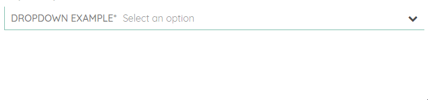

# FormElementsModule

The properties / methods listed under every component are specific to the UI-kit. All components support both <a href="https://angular.io/guide/reactive-forms">Model-Driven</a> and <a href="https://angular.io/guide/forms#template-driven-forms">Template-Driven</a> form approaches. The properties / methods exposed by either of the approaches are not documented as component-specific and are assumed to be familiar to the developer.

## sq-input


sq-input represents a thin wrapper over the native HTML `input` element.

```html
<sq-input formControlName="name" controlLabel="Test Label*" controlPlaceholder="Test placeholder"></sq-input>
```

### Component properties:

- **`@Input()` name:** `string` - Name of the input. If not provided, a generic name is generated, using the following pattern: `'sq-form-control' + new Date().getTime().toString()`.

- **`@Input()` controlId:** `string` - Id of the input. If not provided, a generic name is generated, using the following pattern: `'sq-form-control' + new Date().getTime().toString()`.

- **`@Input()` controlLabel:** `string` - Label of the input. Defaults to empty string.

- **`@Input()` controlPlaceholder:** `string` - Placeholder of the input. Defaults to empty string.

- **`@Input()` required:** `boolean` - When using the template-driven approach, this property determines if the input is required. Defaults to false.

- **`@Input()` pattern:** `any` - When using the template-driven approach, this property determines the pattern against which the input value is validated. Defaults to empty string.

- **`@Input()` disabled:** `boolean` - Enables/disables the component.

For template-driven and reactive-driven code examples, please refer to the examples page.

## sq-button


sq-button is thin wrapper over the native HTML `button` element.

```html
<sq-button [disabled]="testForm.invalid" type="submit">Submit</sq-button>
```

### Component properties:

- **`@Input()` name:** `string` - Name of the input. If not provided, a generic name is generated, using the following pattern: `'sq-form-control' + new Date().getTime().toString()`.

- **`@Input()` controlId:** `string` - Id of the input. If not provided, a generic name is generated, using the following pattern: `'sq-form-control' + new Date().getTime().toString()`.

- **`@Input()` controlLabel:** `string` - Label of the inputcheckbox. Defaults to empty string.

- **`@Input()` controlPlaceholder:** `string` - Placeholder of the input. Defaults to empty string.

- **`@Input()` required:** `boolean` - When using the template-driven approach, this property determines if the input is required. Defaults to false.

- **`@Input()` pattern:** `any` - When using the template-driven approach, this property determines the pattern against which the input value is validated. Defaults to empty string.

- **`@Input()` disabled:** `boolean` - Enables/disables the component.

For template-driven and reactive-driven code examples, please refer to the examples page.

## sq-checkbox


sq-checkbox is a custom implementation using a wrapper over the native HTML `input[type="checkbox"]` element.

```html
<sq-checkbox controlLabel="Test checkbox" formControlName="checkboxValue"></sq-checkbox>
```

### Component properties:

- **`@Input()` name:** `string` - Name of the checkbox. If not provided, a generic name is generated, using the following pattern: `'sq-form-control' + new Date().getTime().toString()`.

- **`@Input()` controlId:** `string` - Id of the checkbox. If not provided, a generic name is generated, using the following pattern: `'sq-form-control' + new Date().getTime().toString()`.

- **`@Input()` controlLabel:** `string` - Label of the checkbox. Defaults to empty string.

- **`@Input()` required:** `boolean` - When using the template-driven approach, this property determines if the checkbox is required. Defaults to false.

- **`@Input()` isSelected:** `boolean` - Programatically select/deselect the checkbox.

- **`@Output()` isSelectedChange:** `EventEmitter<boolean>` - Callback invoked when the checkbox has been selected/deselected.

- **`@Input()` disabled:** `boolean` - Enables/disables the component.

For template-driven and reactive-driven code examples, please refer to the examples page.

## sq-dropdown



sq-dropdown is a custom implementation of a dropdown which emulates the behavior of the regular HTML `select` tag. Its model returns a **copy** of the selected object.

```html
<sq-dropdown formControlName="dropdown" [options]="dropdownOptions" controlLabel="Dropdown Example*" controlPlaceholder="Select an option">
</sq-dropdown>
```

In [app.component.ts](https://github.com/SQ-UI/ng-sq-ui/blob/master/src/app/app.component.ts) import:

```typescript
import { LabelValuePair } from 'ng-sq-ui';
```

and then declare options in [app.component.ts](https://github.com/SQ-UI/ng-sq-ui/blob/master/src/app/app.component.ts#L15)
:

```typescript
  //...
  dropdownOptions: LabelValuePair[] = [
    {
      label: 'option1',
      value: 'someVal1'
    },
    {
      label: 'option2',
      value: 'someVal2'
    },
    {
      label: 'option3',
      value: 'someVal3'
    }
  ];
```

### Component properties:

- **`@Input()` name:** `string` - Name of the dropdown. If not provided, a generic name is generated, using the following pattern: `'sq-form-control' + new Date().getTime().toString()`.

- **`@Input()` controlId:** `string` - Id of the dropdown. If not provided, a generic name is generated, using the following pattern: `'sq-form-control' + new Date().getTime().toString()`.

- **`@Input()` controlLabel:** `string` - Label of the dropdown. Defaults to empty string.

- **`@Input()` controlPlaceholder:** `string` - Placeholder of the dropdown. Defaults to empty string.

- **`@Input()` required:** `boolean` - When using the template-driven approach, this property determines if the dropdown is required. Defaults to false.

- **`@Input()` pattern:** `any` - When using the template-driven approach, this property determines the pattern against which the dropdown value is validated. Defaults to empty string.dropdown

- **`@Input()` options:** `LabelValuePair[]` - The options for the dropdown.

- **`@Output()` onSelectItem:** `EventEmitter<LabelValuePair>` - Callback which is invoked when an item has been selected.

- **`@Input()` showOptions:** `boolean` - Programatically show/hide the dropdown list of options.

- **`@Input()` disabled:** `boolean` - Enables/disables the component.

### Component methods:

- **toggleOptionsDropdown():** `void` - Shows/hides the options dropdown.
- **selectOption(option: `LabelValuePair`):** `void` - Selects an option from the list.

For template-driven and reactive-driven code examples, please refer to the examples page.

## sq-form-group

sq-form-group is a visual representation of a group of related form elements. Uses content projection via `ng-content`.

In [app.component.html](https://github.com/SQ-UI/ng-sq-ui/blob/master/src/app/app.component.html#L89)

```html
<sq-form-group groupLabel="Radiobuttons Form Group example">
  ...
</sq-form-group>
```

### Component properties:

- **`@Input()` groupLabel:** `string` - Title of the group. Defaults to an empty string.

For code snippets, please refer to the examples page.

## sq-radiobutton


sq-radiobutton is a custom implementation using a wrapper over the native HTML `input[type="radio"]` element.

In [app.component.html](https://github.com/SQ-UI/ng-sq-ui/blob/master/src/app/app.component.html#L91)

```html
<sq-radiobutton name="group1" radioValue="value1" [isSelected]="true" formControlName="radioValue">
</sq-radiobutton>
```

In [app.component.ts](https://github.com/SQ-UI/ng-sq-ui/blob/master/src/app/app.component.ts#L36)

```typescript
constructor(private fb: FormBuilder) {
   this.testForm = this.fb.group({
        radioValue: ['value1'],
    });
}
```

### Component properties:

- **`@Input()` name:** `string` - Name of the radiobutton. If not provided, a generic name is generated, using the following pattern: `'sq-form-control' + new Date().getTime().toString()`. If the radiobutton is part of a radiobutton group, all of the related radiobuttons should have the same value for **name**.

- **`@Input()` controlId:** `string` - Id of the radiobutton. If not provided, a generic name is generated, using the following pattern: `'sq-form-control' + new Date().getTime().toString()`.

- **`@Input()` controlLabel:** `string` - Label of the radiobutton. Defaults to empty string.

- **`@Input()` disabled:** `boolean` - Enables/disables the component.

- **`@Input()` radioValue:** `any` - Value of the radiobutton. Defaults to undefined.

- **`@Input()` isSelected:** `boolean` - Programatically select/deselect the radiobutton.

- **`@Output()` isSelectedChange:** `EventEmitter<boolean>` - Callback invoked when the radiobutton has been selected/deselected.

For template-driven and reactive-driven code examples, please refer to the examples page.

## sq-tags-input


sq-tags-input represents a collection of strings populated by the user through an input. Its model returns a **copy** of the string array.

In [app.component.html](https://github.com/SQ-UI/ng-sq-ui/blob/master/src/app/app.component.html#L61)

```html
<sq-tags-input formControlName="tags" controlLabel="Tags*" controlPlaceholder="Type something and press Space">
</sq-tags-input>
```

In [app.component.ts](https://github.com/SQ-UI/ng-sq-ui/blob/master/src/app/app.component.ts#L34)

```typescript
constructor(private fb: FormBuilder) {
   this.testForm = this.fb.group({
      tags: [['tag1'], Validators.required],
    });
}
```

### Component properties:

- **`@Input()` name:** `string` - Name of the tags-input. If not provided, a generic name is generated, using the following pattern: `'sq-form-control' + new Date().getTime().toString()`.

- **`@Input()` controlId:** `string` - Id of the tags-input. If not provided, a generic name is generated, using the following pattern: `'sq-form-control' + new Date().getTime().toString()`.

- **`@Input()` controlLabel:** `string` - Label of the tags-input. Defaults to empty string.

- **`@Input()` controlPlaceholder:** `string` - Placeholder of the tags-input. Defaults to empty string.

- **`@Input()` required:** `boolean` - When using the template-driven approach, this property determines if the tags-input is required. Defaults to false.

- **`@Input()` pattern:** `any` - When using the template-driven approach, this property determines the pattern against which the tags-input value is validated. Defaults to empty string.

- **`@Input()` disabled:** `boolean` - Enables/disables the component.

For template-driven and reactive-driven code examples, please refer to the examples page.

### Class properties:

- **newTagName:** `string` - The model for the input where the user types in a new tag.

### Component methods:

- **removeTag(tagIndex: `number`):** `void` - Removes a tag by given index.

## sq-typeahead


sq-typeahead represents a collection of items shown to the user after they have input query. Its model returns an array of `SearchResult` items the user has selected from the result list. The returned array consists of **copies** of the chosen items.

In [app.component.html](https://github.com/SQ-UI/ng-sq-ui/blob/master/src/app/app.component.html#L70)

```html
<sq-typeahead name="typeahead"
  displayProp="displayName"
  formControlName="typeahead"
  [searchResults]="searchResults"
  (onUserInputEnd)="searchMethod($event)"
  controlLabel="Typeahead*"
  controlPlaceholder="Type something in">
</sq-typeahead>
```

In [app.component.ts](https://github.com/SQ-UI/ng-sq-ui/blob/master/src/app/app.component.ts#L41)

```typescript
import { SearchResult } from 'ng-sq-ui';
//...
export class AppComponent {
  searchResults: SearchResult[];
  //...
  constructor(private fb: FormBuilder) {
    this.testForm = this.fb.group({
        typeahead: [[], Validators.required],
    });
  }
  //...
  searchMethod(query) {
    this.searchResults = [
      {
        displayName: 'Search result 1',
        value: 1
      },
  }
}
```

> If you wish to pass just an array of string, you must omit the property `displayProp` in the html.

### Component properties:

- **`@Input()` name:** `string` - Name of the typeahead. If not provided, a generic name is generated, using the following pattern: `'sq-form-control' + new Date().getTime().toString()`.

- **`@Input()` controlId:** `string` - Id of the typeahead. If not provided, a generic name is generated, using the following pattern: `'sq-form-control' + new Date().getTime().toString()`.

- **`@Input()` controlLabel:** `string` - Label of the typeahead. Defaults to empty string.

- **`@Input()` controlPlaceholder:** `string` - Placeholder of the typeahead. Defaults to empty string.

- **`@Input()` required:** `boolean` - When using the template-driven approach, this property determines if the typeahead is required. Defaults to false.

- **`@Input()` pattern:** `any` - When using the template-driven approach, this property determines the pattern against which typeahead value is validated. Defaults to empty string.

- **`@Input()` disabled:** `boolean` - Enables/disables the component.

- **`@Output()` onUserInputEnd:** `EventEmitter<string>` - Callback invoked after the user has typed in a search `query`. Every new `query` is invoked with a delay (by default: 500ms).

- **`@Input()` delay:** `number` - The time in milliseconds to delay the **onUserInputEnd** emitter.

- **`@Input()` searchResults:** `SearchResult[]` - The list of results shown to the user after the last value which **onUserInputEnd** has emitted.

- **`@Input()` multiple:** `boolean` - Allow the user to choose multiple items from the search results list. Defaults to `false`.

- **`@Input()` displayProp:** `string` - Specify which property of the object to use as display property. If you are just passing an array of strings you must not assign a value to this property.

### Class properties:

- **queryInputControl:** `FormControl` - The model for the input where the user types in a `query`.
- **isLoading:** `boolean` - A flag to show/hide the loadbar of the typeahead.
- **hideResults:** `boolean` - A flag to show/hide the search results list.

### Component methods:

- **selectSearchResult(result: `SearchResult`):** `void` - Selects a result.
- **removeSearchResult(itemIndex: `number`):** `void` - Remove a search item by given index.

For template-driven and reactive-driven code examples, please refer to the examples page.
