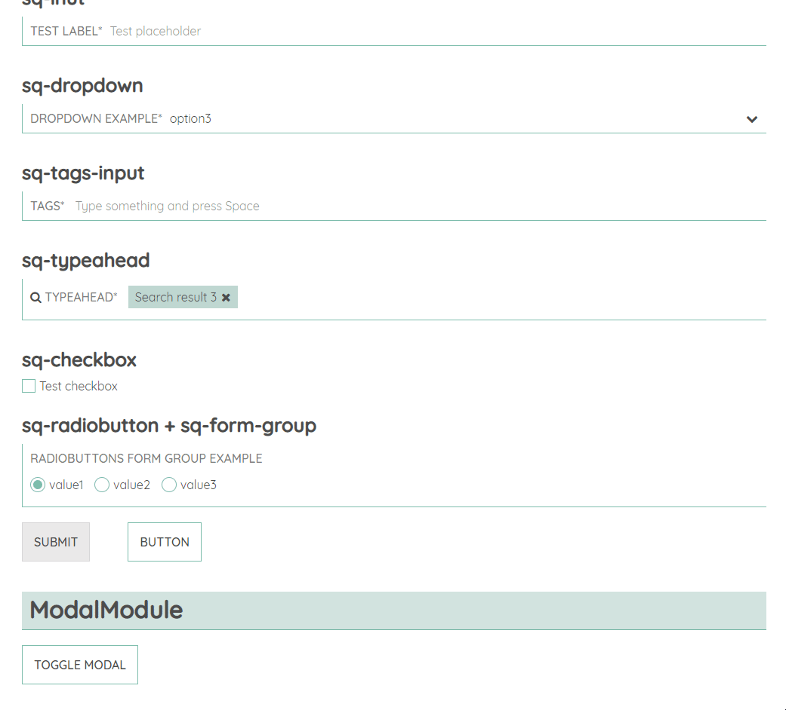

# ModalModule

## sq-modal

sq-modal is a generic modal window with content projection.

### Component properties:

- **`@Input()` customCssAnimation:** `{ duration: number, entranceAnimation: string, exitAnimation: string }` - A configurational object which determines the CSS animation the modal uses. The duration of the animation is in milliseconds. The default values for each property are:
  `{ duration: 1000, entranceAnimation: 'flipInX', exitAnimation: flipOutX }`.

- **`@Input()` show:** `boolean` - Shows/hides the modal window. Defaults to `false`.

- **`@Output()` showChange:** `EventEmitter<boolean>` - Callback invoked whenever the modal is shown/hidden.

### Component methods:

- **close():** `void` - Closes the modal.
