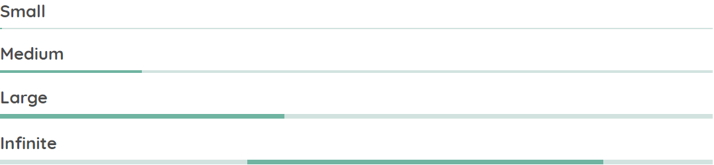

# ProgressBarModule

## sq-progress-bar



sq-progress-bar is a highly customizable loader module.

In [app.component.html](https://github.com/SQ-UI/ng-sq-ui/blob/master/src/app/app.component.html#L211)

```html
<sq-progress-bar
    size="small"
    [loaded]="progressBarLoaded">
</sq-progress-bar>
```

In [app.component.ts](https://github.com/SQ-UI/ng-sq-ui/blob/master/src/app/app.component.ts#L109)

```typescript
//...
export class AppComponent {
  //...
  ngOnInit() {
    const source = interval(1000);
    // Source should be unsubscribed on destroy
    source.subscribe((val) => {
      this.progressBarLoaded += 20;

      if (this.progressBarLoaded > 100) {
        this.progressBarLoaded = 0;
      }
    });
  }
  //...
}
```

### Component properties:

- **`@Input()` size:** `string = 'small' | 'medium' | 'large'` - Visual size of the component.

- **`@Input()` loaded:** `number` - Current loaded value in %.

- **`@Input()` infinite:** `boolean` - A flag denoting if cyclic animation should be enabled. If set to `true` the `loaded` value is ignored. Defaults to `false`;
