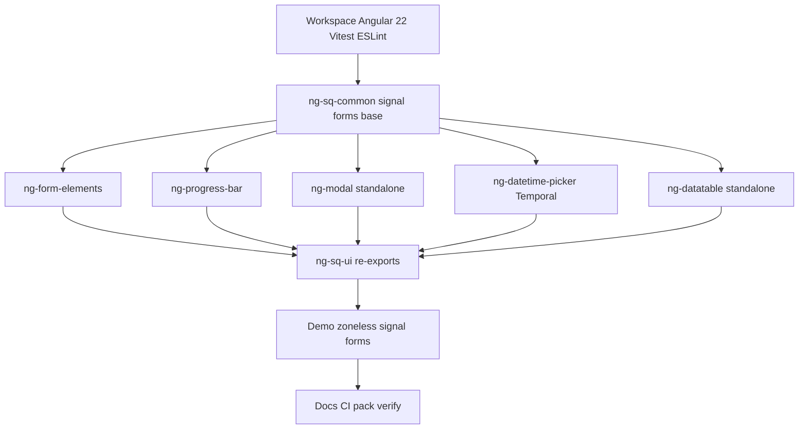

# Migrate ng-sq-ui to Angular 22

## Current state (this repo — source of truth)

- Workspace root [`package.json`](../package.json): **Angular 16.0.x**, TypeScript 4.9, RxJS 7, **ESLint 8** + `@angular-eslint` 16, **Jest** + `jest-preset-angular`, Node **18** CI. Leftover `tslint.json` / codelyzer / jasmine types remain.
- [`tsconfig.json`](../tsconfig.json): Ivy (no `enableIvy: false`); `target` ES2022; `emitDecoratorMetadata: true`.
- Projects in [`angular.json`](../angular.json):
  - App: `sq-ui` (demo) — `@angular-devkit/build-angular:browser`
  - Libs (**7**): `ng-sq-common`, `ng-form-elements`, `ng-progress-bar`, `ng-modal`, `ng-datetime-picker`, `ng-datatable`, `ng-sq-ui`
  - Form elements live in [`projects/ng-form-elements`](../projects/ng-form-elements); progress bar in [`projects/ng-progress-bar`](../projects/ng-progress-bar); `ng-sq-ui` re-exports them via `NgSqUiModule`
- Form controls extend [`ControlValueAccessorEnabler`](../projects/ng-sq-common/src/lib/entities/control-value-accessor-enabler.ts) / [`InputCoreComponent`](../projects/ng-sq-common/src/lib/entities/input-core-component.ts) with `NG_VALUE_ACCESSOR`.
- Templates use `*ngIf` / `*ngFor` / inner `[(ngModel)]`; demo uses `UntypedFormGroup` + `formControlName`.
- Lib packages already at **`2.0.1`** with empty peerDependencies.

## Target stack

| Area | Choice |
|------|--------|
| Framework | **Angular 22.0.x** (signal-first; Signal Forms stable) |
| TypeScript / Node | **TS 5.9+ / 6.x as required by Angular 22**, **Node 22+** |
| Package versions | Major bump **`@sq-ui/*` → 3.0.0**, peers `@angular/*` **^22.0.0** |
| Components | **Standalone only** (remove NgModules); `input()` / `output()` / `model()` / signal queries; **OnPush** |
| Forms | **`FormValueControl` / `FormCheckboxControl`** from `@angular/forms/signals`; demo uses `form()` + `[formField]`; **`compatForm`** from `@angular/forms/signals/compat` in tests/docs for Reactive Forms consumers |
| Change detection | **Zoneless** demo (`provideZonelessChangeDetection()`); **remove `zone.js`** from deps/polyfills |
| Dates | Replace **moment** with **Temporal** (`Temporal.PlainDate` / `PlainTime` / `PlainDateTime`) + **`@js-temporal/polyfill`** for Safari |
| Collections | Replace **immutable** `List` with native arrays + signals |
| Icons | **@fortawesome/fontawesome-free 6.x** |
| Lint | **ESLint 9** flat config + **@angular-eslint 22** |
| Test | **Vitest** (Angular 22 default); drop Jest |
| e2e | None required for this migration |
| Build | `@angular/build:application` for app; **ng-packagr 22** for libs; `--configuration production` |

## Migration strategy

From Angular 16 Ivy, prefer:

1. Official **`ng update` major-by-major 16→22** (land schematics/TS/ng-packagr each step).
2. After the workspace compiles on 22: `ng g @angular/core:signals`, `ng g @angular/core:control-flow`.
3. Modernize libraries bottom-up (`ng-sq-common` → form-elements / progress-bar / modal / datetime / datatable → `ng-sq-ui` → demo → docs/CI).
4. Keep a layered verification loop (unit → demo integration → `npm pack` → browsers).

## Phase 1 — Workspace / tooling

Update root [`package.json`](../package.json), [`angular.json`](../angular.json), [`tsconfig.json`](../tsconfig.json) and per-project tsconfigs:

- Angular 22 + ng-packagr 22 + compatible TypeScript + RxJS 7.x; **drop zone.js** (after zoneless demo), core-js (if unused), codelyzer, tslint leftovers, rimraf if unused.
- App: `@angular/build:application`; drop obsolete `aot` / `buildOptimizer` / `browserTarget` → `buildTarget`.
- tsconfig: `module`/`target` **ES2022+**; remove `emitDecoratorMetadata`.
- Lib builds: `allowedNonPeerDependencies`; keep `build:libs` order (7 packages).
- Lint: delete all `tslint.json`; add `eslint.config.js` (flat) with `@angular-eslint` 22.
- Test: migrate architect targets from Jest to **Vitest**.
- Path mappings: source entry points for all 7 `@sq-ui/*` packages.
- CI: Node 22, actions v4.

## Phase 2 — `ng-sq-common` foundation

Files: [`projects/ng-sq-common`](../projects/ng-sq-common).

- Convert `PaginatorComponent`, directives to **standalone** + OnPush.
- **Decompose** `InputCoreComponent` / `ControlValueAccessorEnabler` into composition helpers (or a thin base) implementing Signal Forms control contracts:
  - `FormValueControl<T>`: `value = model<T>(...)`, shared label/id/placeholder as `input()`, form state as `input()`s.
  - `FormCheckboxControl`: `checked = model<boolean>()` (**no** `value`).
- Replace [`CustomEventBroadcasterService`](../projects/ng-sq-common/src/lib/services/custom-event-broadcaster.service.ts) with a **signal-based** radio-group mechanism.
- **Breaking**: remove public exports of `InputCoreComponent` / `ControlValueAccessorEnabler`.
- **Remove** `NgSqCommonModule` (standalone-only public API).
- Peers `^22.0.0`; package `3.0.0`.

## Phase 3 — Leaf libraries

### `ng-modal`

- Standalone `ModalComponent`: `show = model(false)`, `input()` animation config, `viewChild()` queries.
- Prefer class bindings / signals over Renderer2 toggles for zoneless.
- Drop NgModule.

### `ng-datetime-picker`

- Replace moment with **Temporal** types in [`calendar-manager.service.ts`](../projects/ng-datetime-picker/src/lib/datetime-picker/calendar-manager.service.ts) and picker components; depend on `@js-temporal/polyfill`.
- `DatetimePickerComponent` / `TimePickerComponent` implement `FormValueControl`; drop CVA / inner `ngModel`.
- Drop Immutable `List` → arrays/signals of Temporal values.
- Drop NgModule; modern control flow.

### `ng-datatable`

- Standalone + `input()` / `output()` / `contentChild()` / `viewChild()`.
- Replace `OnChanges` with `computed()` / `effect()` where practical.
- Replace `EventEmitter.observers` branching with always-emit or an explicit sort callback `input()`.
- Drop NgModule.

## Phase 4 — `ng-form-elements` + `ng-progress-bar`

Under [`projects/ng-form-elements/src/lib`](../projects/ng-form-elements/src/lib) and [`projects/ng-progress-bar`](../projects/ng-progress-bar):

| Control | Signal Forms interface |
|---------|------------------------|
| input, textarea, dropdown, typeahead, tags-input, radiobutton | `FormValueControl` |
| checkbox | `FormCheckboxControl` (`checked`) |
| button, form-group, progress-bar | presentational |

- Run signals + control-flow schematics; finish form-control contracts manually.
- Remove all `NG_VALUE_ACCESSOR` / `forwardRef` / inner `[(ngModel)]`.
- Drop `immutable` in typeahead/tags-input.
- **Delete** `NgFormElementsModule` / `NgProgressBarModule`; barrels via `public-api.ts`.

## Phase 5 — `ng-sq-ui` umbrella + demo

- Delete `NgSqUiModule`; package re-exports standalone symbols only.
- Demo: `bootstrapApplication` + `provideRouter` + **`provideZonelessChangeDetection()`**; no zone.js.
- Standalone routed components; rewrite form demos to Signal Forms (`form()` + `[formField]`).
- Add a small **`compatForm`** example for Reactive Forms consumers.
- Font Awesome 6 asset paths in `angular.json` styles.

## Phase 6 — Docs, README, CI, packaging

- Docsify: standalone imports + `[formField]`; Angular 22 peers; **3.0** breaking changes; Temporal public date types.
- README: standalone-first; GitHub Actions badges.
- CI: `actions/checkout@v4`, `setup-node@v4`, **Node 22**, Vitest coverage.
- Align each lib `package.json` (FA6, Temporal polyfill as appropriate, internal `@sq-ui/*` ^3).
- Verify with **`npm pack`** per library.

## Phase 7 — Verification (layered)

1. **Unit**: full Vitest suite after each major layer; Signal Forms cases per control; Temporal edge cases.
2. **Build**: all 7 libs via ng-packagr 22; demo via application builder; `npm pack` contents check.
3. **Integration**: demo routes (forms, datetime, datatable, modal, common).
4. **Browsers**: Chrome, Firefox, Edge, Safari — Temporal polyfill + zoneless.

## Breaking changes (3.0 notes)

- Requires **Angular 22+**, Node 22+.
- **NgModules removed** — import standalone components/directives.
- Form integration: Signal Forms control interfaces (`[formField]`); CVA base classes removed; Reactive consumers guided via docs/`compatForm`.
- Public removal of `InputCoreComponent` / `ControlValueAccessorEnabler`.
- **moment → Temporal** (+ polyfill); **immutable** removed; **Font Awesome 6**.
- Zoneless-ready components (OnPush + signals).
